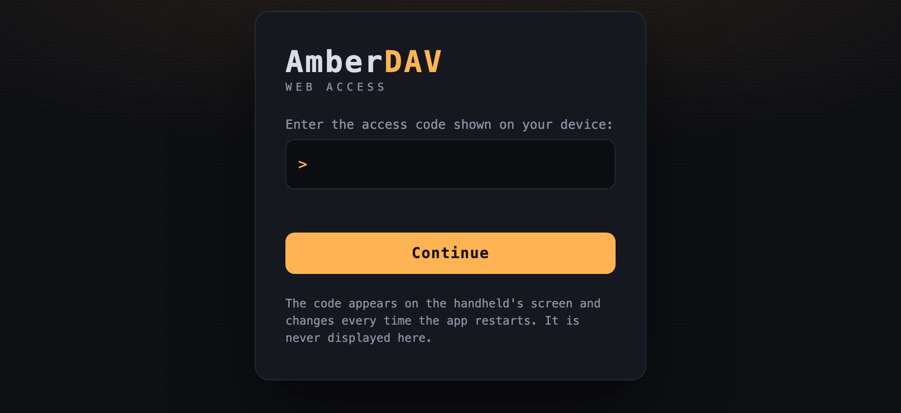
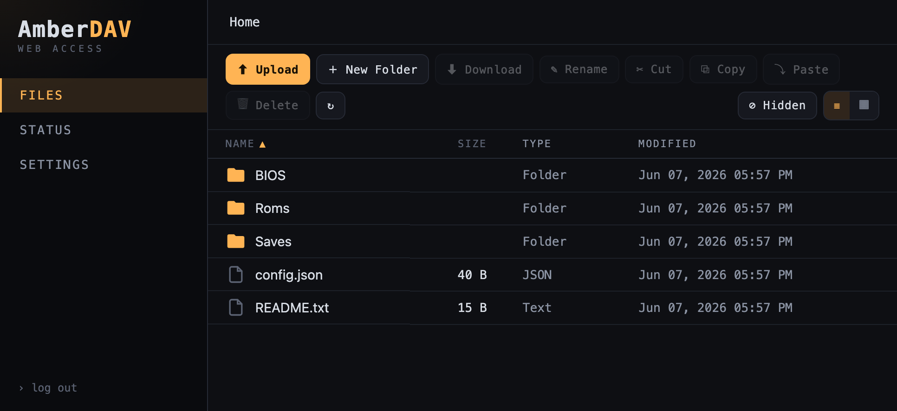
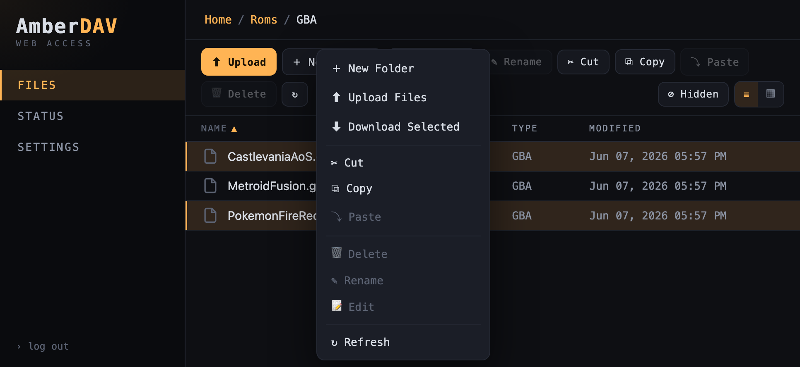

# AmberDAV

A tiny, single-binary file server and utility originally designed for Anbernic
handhelds, but expanded to Windows and macOS. Point a browser at the device
and you get a full file manager; mount it as a network drive over WebDAV;
and read the device's IP, password, and a scannable QR code straight off
the device's screen, or terminal.

Built and tested on the **RG35XX Pro** and **RG34XXSP** (Allwinner H700 /
aarch64, stock Anbernic OS). The whole thing is one statically-linked binary
with no runtime dependencies.

## Features

- **File-manager web UI** — a single-page app served at `http://<device-ip>:8080/`:
  list/grid views, image thumbnails, a hidden-files (dotfiles) toggle, in-browser
  preview (images, video, audio, text) with arrow-key gallery navigation, an
  in-browser text editor to edit files in place (e.g. `config.json`), breadcrumbs,
  sortable columns, shift-click range select, right-click context menu (new
  folder, upload, download, cut/copy/paste, delete, rename), drag-and-drop upload
  with a progress bar, and zip download of folders or multi-selections.
- **WebDAV server** — mount the device as a network drive from any WebDAV
  client (Finder, Windows Explorer, `rclone`, etc.) at
  `http://<device-ip>:8080/dav` (also browsable directly in a web browser).
- **On-screen connection info** — the device's IP, login password, and a QR
  code (linking to the web UI) are drawn directly to the framebuffer
  (`/dev/fb0`), so a headless handheld is usable the moment it boots the app.
- **Live gamepad button viewer** — the Status tab streams every button/axis
  event (name + raw evdev code + up/down) live over SSE; handy for discovering
  button mappings.
- **Unified settings** — every setting (root, port, bind address, password,
  permission level, default folder, screensaver) is reachable three ways with a
  clear precedence: **CLI flags → `AMBERDAV_*` env vars → config file →
  defaults**. The web UI displays settings read-only; it never edits the file.

## Screenshots

| Login | File manager | Context menu |
|:---:|:---:|:---:|
|  |  |  |

## Build

Cross-compiled from any host (macOS/Linux/Windows) to a static aarch64 musl
binary using [`cargo-zigbuild`](https://github.com/rust-cross/cargo-zigbuild)
(Zig is the cross-linker; the whole dependency tree is pure Rust).

```sh
# One-time setup
rustup target add aarch64-unknown-linux-musl
cargo install cargo-zigbuild
# Zig must be installed and on PATH — e.g. `brew install zig`,
# `pip install ziglang`, or from https://ziglang.org/download/

# Device build — `--features fb` pulls in the on-device screen + gamepad UI.
cargo zigbuild --release --target aarch64-unknown-linux-musl --features fb
```

The **`fb`** and **`sdl`** features each gate the device-only code (gamepad
input, DVD-bounce screensaver, the on-screen connection canvas) and its
dependencies; they differ only in the display sink — `fb` is the static
framebuffer/Wayland sink, `sdl` links the system libSDL2. Both are **opt-in**:
with neither you get a smaller, headless WebDAV/file-server binary suited to
desktops and servers. Build a headless binary for any target by simply omitting
the features, e.g. `cargo build --release` or
`cargo zigbuild --release --target x86_64-unknown-linux-musl`.

Output: `target/aarch64-unknown-linux-musl/release/amber-dav` (~2 MB, static):

```
$ file target/aarch64-unknown-linux-musl/release/amber-dav
ELF 64-bit LSB executable, ARM aarch64, statically linked, stripped
```

The same aarch64 binary runs on both the RG35XX Pro and the RG34XXSP.

### Prebuilt binaries

Each [GitHub Release](../../releases) ships a prebuilt binary per platform:

Assets follow `amber-dav-<arch>-<os>[-fb|-sdl]`: plain `<arch>-<os>` is the
standard headless build, the `-fb` suffix marks the static build with the
on-device framebuffer/Wayland UI compiled in, and `-sdl` is the dynamic
on-screen build (links the system libSDL2).

| Asset | Platform | Build |
| --- | --- | --- |
| `amber-dav-aarch64-linux-fb` | the Anbernic device (static musl) | fb |
| `amber-dav-aarch64-linux-sdl` | Anbernic (SDL/`mali` on-screen QR) | sdl (dynamic, needs libSDL2) |
| `amber-dav-aarch64-linux` | ARM Linux servers/Raspberry Pi/NAS/Graviton (static musl) | headless |
| `amber-dav-x86_64-linux` | x86 Linux servers/NAS/Docker (static musl) | headless |
| `amber-dav-x86_64-linux-fb` | x86 Linux handhelds without libSDL2 | fb |
| `amber-dav-x86_64-linux-sdl` | Steam Deck (on-screen QR) | sdl (dynamic, needs libSDL2) |
| `amber-dav-aarch64-macos` | macOS, Apple Silicon | headless |
| `amber-dav-x86_64-macos` | macOS, Intel | headless |
| `amber-dav-x86_64-windows` | Windows | headless |
| `amber-dav-aarch64-windows` | Windows on ARM (Snapdragon/Copilot+ PCs) | headless |

The `-fb` and `-sdl` assets are built with `--features fb` and `--features sdl`
respectively: both include the on-device screen and gamepad viewer (differing
only in the display sink). Every other asset is a
**headless** WebDAV/file-server CLI that writes to stdout — a quick way to host
a folder from a desktop or server:

```sh
amber-dav /path/to/folder 8080          # positional root + port
amber-dav --root /path/to/folder --port 8080 --bind 127.0.0.1
amber-dav --help                        # full flag/env list
```

## Install on Anbernic device

The stock OS launches apps from `Roms/APPS/` on the SD card: a `*.sh` script
there appears in the Apps menu, and the filename becomes the menu label. This
repo ships a ready-made launcher under [`example_APPS/`](example_APPS).

Copy this layout to the SD card (the games/second card on a two-slot device):

```
Roms/APPS/WebDAV.sh            <- launcher (this is the Apps-menu entry)
Roms/APPS/webdav/amber-dav     <- the aarch64 binary you built
Roms/APPS/webdav/config.json   <- written automatically on first launch
Roms/APPS/webdav/log.txt       <- created on launch (IP, password, QR text)
```

Then launch **WebDAV** from the device's Apps menu. `WebDAV.sh` serves the whole
SD card root (two levels up from `Roms/APPS`) on port `8080` and writes startup
output to `log.txt`. Edit the script to change the port, served root, or screen
rotation — it's commented.

> The binary takes optional `[ROOT] [PORT]` positional arguments (defaults:
> current dir, `8080`). CLI flags and `AMBERDAV_*` env vars take precedence over
> `config.json`, so a launcher can override the file without editing it.

## Install on Steam Deck

### Steam Deck — on-screen QR via SDL

Use the **`amber-dav-x86_64-linux-sdl`** asset. Unlike the framebuffer/Wayland
build (whose native-Wayland surface Steam never foregrounds in Game Mode), the
SDL build opens an **X11/Xwayland** window — the kind Steam *does* foreground —
so the IP/password/QR screen shows. Add it as a Non-Steam Game and launch it.

The SDL build links the system `libSDL2` (present on SteamOS) and auto-selects
the video driver (`x11` on the Deck). Force one with `SDL_VIDEODRIVER` if needed.
The static framebuffer build still works for the Anbernic and for any OS without
libSDL2; the SDL build is the one that displays in Steam Game Mode.

1. In Desktop Mode, copy the binary somewhere persistent (e.g. `~/Applications`).
2. Add it to Steam as a **Non-Steam Game**, then switch to Game Mode and launch it.
3. The connection screen appears; scan the QR or read the IP/password.
4. Quit with the configured exit button (the **☰ Menu** button by default; see
   `exit_keys`) or by closing the window from the Steam overlay.

Optionally point `--connection-file` at a path a launcher script or a Decky
plugin can read (e.g. `--connection-file ~/.local/share/amber-dav/connection.json`).

> A Decky Loader plugin would live in its own repo and bundle this same binary;
> amber-dav needs no Decky-specific code.

### Anbernic — SDL on-screen QR (optional)

The **`amber-dav-aarch64-linux-sdl`** asset renders the same screen via SDL's
`mali` vendor driver (what the stock emulators use), as an alternative to the
static framebuffer build. Just launch it from an APPS-menu `*.sh` script like
any other binary — the SDL driver is auto-selected (`mali` on the Anbernic, once
`x11` is found unavailable), so no `SDL_VIDEODRIVER` is needed. Set
`SDL_VIDEODRIVER=mali` only to force it and skip the auto-detection.

## First launch

On startup the device screen and `log.txt` show the connection details:

```
  amber-dav
  serving:  /mnt/sdcard
  status:   http://192.168.1.42:8080/
  webdav:   http://192.168.1.42:8080/dav
  password: 9vqcm   (user: anything)
  <QR code to the status page>
```

- **Web UI:** open `http://<device-ip>:8080/` (or scan the QR), log in with the
  password shown on the device. The password is shown **on the device only** —
  never in the browser.
- **WebDAV:** point a client at `http://<device-ip>:8080/dav`. The username is
  ignored; the password is the one on screen.

By default the password is a fresh random 5-character code each launch. Set a
fixed `password` in `config.json` (below) so you don't have to re-read it every
time.

## Configuration

Every setting can be supplied three ways. When a setting is given in more than
one place, the highest layer wins:

1. **CLI flags** — `--root`, `--port`, … (run `amber-dav --help` for the list)
2. **`AMBERDAV_*` env vars** — for containers/deployment
3. **`config.json`** — persisted preferences
4. **compiled-in defaults**

| Setting | CLI flag | Env var | Config key |
|---|---|---|---|
| Served root | `--root <path>` (or positional 1) | `AMBERDAV_ROOT` | `root` |
| Port | `--port <n>` (or positional 2) | `AMBERDAV_PORT` (or `PORT`) | `port` |
| Bind address | `--bind <addr>` | `AMBERDAV_BIND` | `bind` |
| Password | `--password <pw>` | `AMBERDAV_PASSWORD` | `password` |
| Show password | `--display-password` / `--no-display-password` | `AMBERDAV_DISPLAY_PASSWORD` | `display_password` |
| Default folder | `--default-folder <path>` | `AMBERDAV_DEFAULT_FOLDER` | `default_folder` |
| Permission | `--permission <level>` | `AMBERDAV_PERMISSION` | `permission` |
| Screensaver on | `--bounce-screen` / `--no-bounce-screen` | `AMBERDAV_BOUNCE_SCREEN` | `bounce_screen.enabled` |
| Screensaver folders | `--bounce-folders <a,b,…>` | `AMBERDAV_BOUNCE_FOLDERS` | `bounce_screen.folders` |
| Connection file | `--connection-file <path>` | `AMBERDAV_CONNECTION_FILE` | `connection_file` |
| Exit key codes | `--exit-keys <a,b,…>` | `AMBERDAV_EXIT_KEYS` | `exit_keys` |
| Blank-screen key codes | `--blank-keys <a,b,…>` | `AMBERDAV_BLANK_KEYS` | `blank_keys` |
| Bounce-toggle key codes | `--bounce-keys <a,b,…>` | `AMBERDAV_BOUNCE_KEYS` | `bounce_keys` |
| Display sink | — | `AMBERDAV_DISPLAY` | — |

### Config file location

| Build | Location |
|---|---|
| device (`fb`/`sdl`) | next to the binary — `config.json` |
| macOS | `~/Library/Application Support/amber-dav/config.json` |
| Windows | `%APPDATA%\amber-dav\config\config.json` |
| Linux (headless) | `$XDG_CONFIG_HOME/amber-dav/config.json` → `~/.config/amber-dav/config.json` |

`$AMBERDAV_CONFIG` overrides the location on any build.

On **device** (`fb`/`sdl`) builds a default `config.json` is written next to the
binary on first launch (the device is configured through the web UI). **Headless** builds
never write a config implicitly — run with `--save` to write the fully-resolved
settings (CLI + env merged onto any existing file) to the config path and exit:

```sh
amber-dav --root /mnt/media --password secret --permission read_only --save
# → writes the config file with those values, then exits
```

> **Migrating from an older desktop build:** the config no longer lives next to
> the binary on desktop/server installs — it moved to the platform location
> above. Move your existing `config.json` there (or point `$AMBERDAV_CONFIG` at
> it, or re-create it with `--save`); otherwise it is ignored and defaults apply.

```jsonc
{
  // Fixed login password. Omit or leave empty for a fresh random code each boot.
  "password": "littleSecr3t",

  // Show the password on the device screen. Forced on for a random password
  // (otherwise it could never be discovered). Set false to hide a fixed one.
  "display_password": true,

  // Absolute path to serve. Omit/empty to use the CLI argument / default (".").
  "root": null,

  // Port to listen on. Omit/null to use the CLI argument / default (8080).
  "port": null,

  // Address to bind. Omit/null for 0.0.0.0 (all interfaces); "127.0.0.1" for
  // tunneled/proxied deployments.
  "bind": null,

  // Folder (relative to root) to open right after login. "" = root.
  "default_folder": "Roms",

  // Allowed operations: "read_only" | "read_write" | "read_write_delete".
  "permission": "read_write_delete",

  // Burn-in screensaver (see Controls). Toggled on-device with the X button.
  "bounce_screen": {
    "enabled": true,
    // Files or folders to draw images from. Folders are scanned recursively.
    // Relative entries resolve against the served root; absolute paths work too.
    "folders": ["Roms/GBA/Imgs", "Roms/SNES/Imgs"]
  }
}
```

Edit the file directly or over WebDAV, then relaunch the app to apply changes.

**Permission levels** are enforced on both the JSON API and the WebDAV mount:

| Level | Read / browse | Create / upload / rename / move | Delete |
|-------|:---:|:---:|:---:|
| `read_only` | ✅ | ❌ | ❌ |
| `read_write` | ✅ | ✅ | ❌ |
| `read_write_delete` | ✅ | ✅ | ✅ |

`permission` and `default_folder` take effect per request. `password`,
`display_password`, `root`, `bounce_screen`, and the `*_keys` lists are bound at
boot — relaunch to apply.

## Device controls

| Button | evdev code | Action |
|--------|:---:|--------|
| **Menu** (`KEY_GOTO`, Anbernic) / **☰** (`BTN_START`, Steam Deck) | 354, 315 | Quit the app and return to the OS menu (`exit_keys`) |
| **A** (`BTN_SOUTH`) | 304 | Blank the screen (all black); press again to restore (`blank_keys`) |
| **X** (`BTN_NORTH`) | 307 | Toggle the bounce screensaver, if `bounce_screen.enabled` (`bounce_keys`) |

The **bounce screensaver** drifts a random image around a black screen,
DVD-logo style, swapping images as it ricochets off the edges — preventing
burn-in on OLED/AMOLED panels during long idle periods. It draws from the
images in `bounce_screen.folders` (PNG, JPEG, GIF, BMP, WebP). With no images
configured it simply blanks to black, which still protects the panel.

Each control is a **list** of evdev codes, so a button can differ per device
(the defaults above already cover the Anbernic and the Steam Deck). Retarget
them from the config file (`exit_keys`/`blank_keys`/`bounce_keys`), the
`AMBERDAV_EXIT_KEYS`/`AMBERDAV_BLANK_KEYS`/`AMBERDAV_BOUNCE_KEYS` env vars
(comma-separated), or `--exit-keys`/`--blank-keys`/`--bounce-keys`. Find a
button's code in the web UI Status tab's live input view.

## Updating via the web UI

The **Settings tab** has a Software Update card. Click **Check for update** and
AmberDAV queries the GitHub Releases API to compare the running version against
the latest release. If a newer build is available, click **Apply update** to
download and install it in place:

1. The matching platform binary is downloaded from GitHub Releases.
2. The current binary is renamed to `amber-dav.old` (in the same directory),
   replacing any previous `.old` file.
3. The new binary is moved into place.
4. Relaunch the app to run the new version — the process is **not** restarted
   automatically.

If anything goes wrong during the rename step, the original binary is restored.

> The update check and apply target the matching prebuilt release asset (see the
> table above). A device binary only ever pulls its own asset — an `-fb` build
> stays `-fb`, an `-sdl` build stays `-sdl`, and a headless binary only the
> headless one — so a device never self-updates across build shapes. Custom
> builds with no matching asset see a "no asset for this platform" response.

## Updating via WebDAV (local builds)

You can replace the binary without pulling the SD card. Because you can't write
over a running executable (`ETXTBSY`), upload to a temp name and `MOVE` it into
place (a rename over a running binary is allowed):

```sh
BIN=target/aarch64-unknown-linux-musl/release/amber-dav
HOST=http://192.168.1.42:8080
PASS=littleSecr3t

# Upload alongside the running binary, then atomically swap it in.
curl -u x:$PASS -T "$BIN" "$HOST/dav/Roms/APPS/webdav/amber-dav.new"
curl -u x:$PASS -X MOVE \
  -H "Destination: $HOST/dav/Roms/APPS/webdav/amber-dav" \
  "$HOST/dav/Roms/APPS/webdav/amber-dav.new"
```

Quit (Menu button) and relaunch from the Apps menu to run the new build. This
requires `permission` to be `read_write` or `read_write_delete`.

## Troubleshooting

- **Screen looks rotated / sideways.** The on-screen info is authored landscape.
  Set `AMBERDAV_FB_ROTATE` to `90`, `180`, or `270` (there's a commented line in
  `WebDAV.sh`).
- **Blank screen / frozen on the loading splash.** Some Allwinner framebuffer
  drivers only present a frame on an `FBIOPAN_DISPLAY` ioctl and use multiple
  buffer pages; amber-dav handles both. Check `log.txt` and the Status tab —
  the screen line reports geometry, e.g. `ok (640x480 32bpp rot=0 pages=2
  virt=960 pan=true) mode=Info`.
- **Buttons don't register.** The input viewer reads `/dev/input/event*`. The
  stock OS runs apps as root, so this normally just works; otherwise the process
  needs read access to those device nodes.
- **Can't connect.** Confirm the phone/PC is on the same LAN/Wi-Fi as the
  handheld, and that the IP in `log.txt` matches what you're hitting.

## Security

This is a **LAN tool**. It serves plain HTTP (no TLS) and authenticates with a
short shared password — fine for a trusted home network, not for the open
internet. Don't port-forward it. Login uses a session cookie; the WebDAV mount
uses HTTP Basic auth. Path-traversal is blocked, and the configured permission
level is enforced on every mutating request.

## Project layout

| File | Purpose |
|------|---------|
| `src/main.rs` | startup, settings resolution, routing, shared state, banner + QR |
| `src/cli.rs` | CLI flags (clap) + CLI/env/file/default precedence resolution |
| `src/config.rs` | `config.json` schema + location, load/save, permission levels |
| `src/auth.rs` | session-cookie login for the web UI |
| `src/webdav.rs` | `dav-server` handler bridged into axum + Basic auth + permission gate |
| `src/files.rs` | JSON file API (list/upload/download/zip/rename/move/copy/delete) + HTTP Range |
| `src/input.rs` | evdev reader → broadcast channel; drives screen controls (device builds only) |
| `src/screen.rs` | draws IP/password/QR to `/dev/fb0`; blank + bounce screensaver (device builds only) |
| `src/ui.rs` | landing/login pages, status/info endpoint, settings (read-only), SSE stream |
| `src/update.rs` | in-app update: GitHub Releases check + binary download/rename dance |
| `src/password.rs` | per-boot password generator |
| `src/web/` | `login.html`, `app.html` (the single-page file manager) |
| `example_APPS/` | ready-to-copy `WebDAV.sh` launcher + SD-card layout |

## License

MIT — see `LICENSE`.
